# Documentación Técnica — Love Rescue (AdoptaMe)

> **Proyecto:** Love Rescue E196 Blanco  
> **Nombre del sistema:** AdoptaMe — Plataforma de Adopción Responsable de Mascotas  
> **Versión:** 1.0.0  
> **Fecha:** Junio 2026

---

## Índice

1. [Diagrama de Contexto (C4 Nivel 1)](#1-diagrama-de-contexto-c4-nivel-1)
2. [Diagrama de Arquitectura](#2-diagrama-de-arquitectura)
3. [Diagrama de Componentes (C4 Nivel 3)](#3-diagrama-de-componentes-c4-nivel-3)
4. [Diagrama de Integraciones](#4-diagrama-de-integraciones)
5. [Diagrama DevOps](#5-diagrama-devops)
6. [Arquitectura Tecnológica](#6-arquitectura-tecnológica)
7. [Inventario Técnico](#7-inventario-técnico)
8. [Matriz de Trazabilidad](#8-matriz-de-trazabilidad)

---

## 1. Diagrama de Contexto (C4 Nivel 1)

### Propósito

Representar las relaciones de negocio entre los actores humanos y el sistema.  
**No incluye** tecnologías, bases de datos, servidores ni detalles de implementación.

### Actores del negocio

| Actor | Rol en el negocio | Acciones principales |
|-------|-------------------|---------------------|
| **Administrador** | Supervisa la plataforma | Aprueba fundaciones, gestiona usuarios, visualiza reportes globales |
| **Fundación** | Entidad de rescate animal | Publica mascotas, recibe y gestiona solicitudes, agenda citas, hace seguimiento post-adopción |
| **Usuario Adoptante** | Persona que desea adoptar | Busca mascotas, envía solicitudes, sube documentos, agenda citas, firma contrato digital |
| **Sistema Love Rescue** | Plataforma digital de adopción | Media la interacción entre fundaciones y adoptantes, gestiona el flujo de adopción |

### Flujo de información (vista de negocio)

- **Administrador** → aprueba/rechaza fundaciones, consulta reportes → **Sistema**
- **Fundación** → registra su perfil, publica mascotas, responde solicitudes → **Sistema**
- **Adoptante** → busca mascotas, solicita adopción, sube documentos, agenda citas → **Sistema**
- **Sistema** → notifica cambios de estado, envía recordatorios → **Fundación** y **Adoptante**

### Diagrama Mermaid (vista de negocio pura)

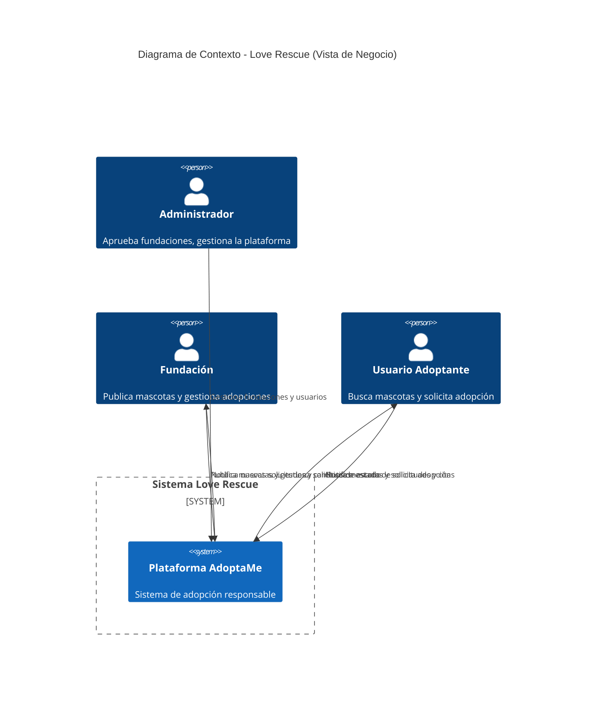

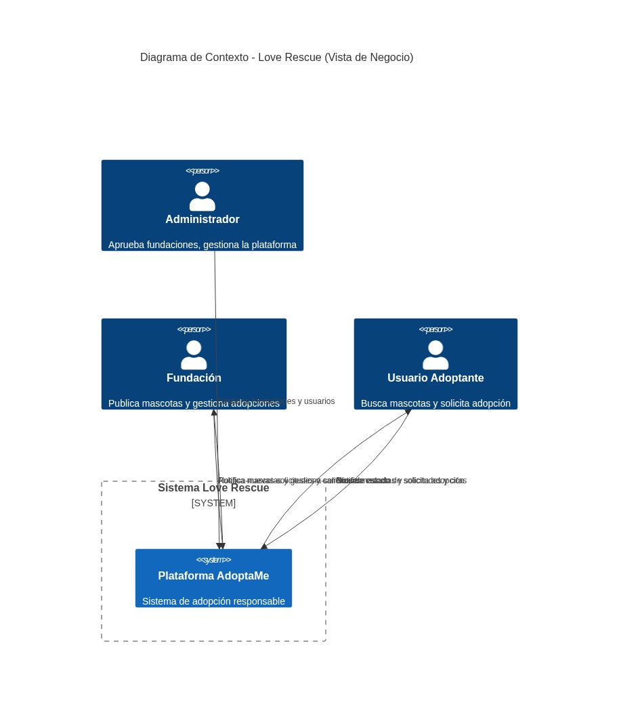

### Explicación del diagrama

El diagrama muestra únicamente las **relaciones de negocio**. No aparecen MySQL, SMTP, Docker, JWT ni ninguna tecnología. El Administrador supervisa el sistema, las Fundaciones publican y gestionan adopciones, y los Adoptantes buscan y solicitan mascotas. El sistema notifica a ambos bandos sobre cambios de estado.

---

## 2. Diagrama de Arquitectura

### Propósito

Representar la **arquitectura técnica real** del proyecto: tecnologías, protocolos, puertos, flujo de comunicación e infraestructura.

### Capas de la arquitectura

| Capa | Componente | Tecnología | Puerto | Protocolo |
|------|-----------|-----------|--------|-----------|
| **Presentación** | Frontend SPA | React 18 + TypeScript + Vite + Tailwind CSS + shadcn/ui | 8080 (dev), 80 (Docker) | HTTP |
| **Servicio web** | Nginx | alpine | 80 | HTTP/Reverse Proxy |
| **API** | Backend REST | Express 5 + Node.js 20 | 3000 | HTTP/JSON |
| **ORM** | Capa de datos | Sequelize 6 + mysql2 | — | TCP |
| **Persistencia** | Base de Datos | MySQL 8.0 | 3306 | TCP |
| **Email** | Servicio SMTP | Gmail + Nodemailer | 587 | SMTP/TLS |
| **Autenticación** | JWT | jsonwebtoken (HS256) + bcryptjs | — | — |
| **Contenedores** | Docker | Multi-stage build | — | — |

### Flujo de comunicación técnica

```
Navegador (usuario)
    │
    ▼
[puerto 80/8080] Nginx (proxy reverso)
    │
    ├── ▶ /api/* ────────────────── ▶ Backend Express (puerto 3000)
    │                                     │
    │                                     ├── ▶ Sequelize ORM ── ▶ MySQL (puerto 3306)
    │                                     │
    │                                     ├── ▶ Nodemailer ── ▶ Gmail SMTP (puerto 587)
    │                                     │
    │                                     └── ▶ JWT (HS256) ── ▶ Validación de tokens
    │
    └── ▶ /* (estáticos: index.html, assets, imágenes)
                └── Servidos directamente por Nginx
```

### Diagrama Mermaid (vista técnica)

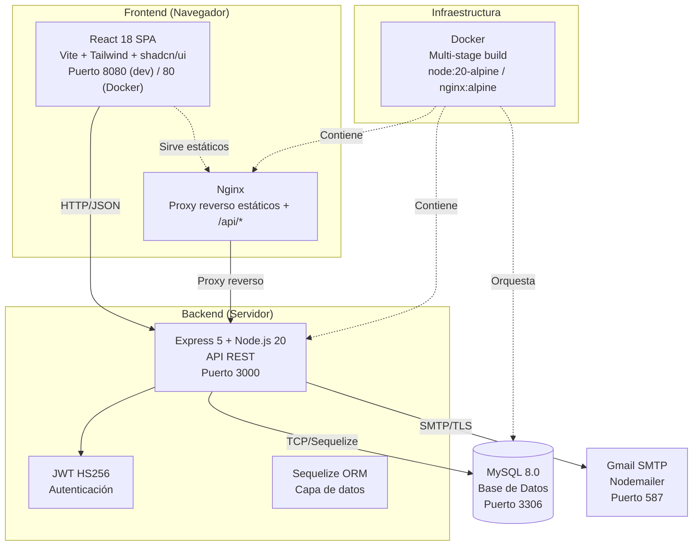

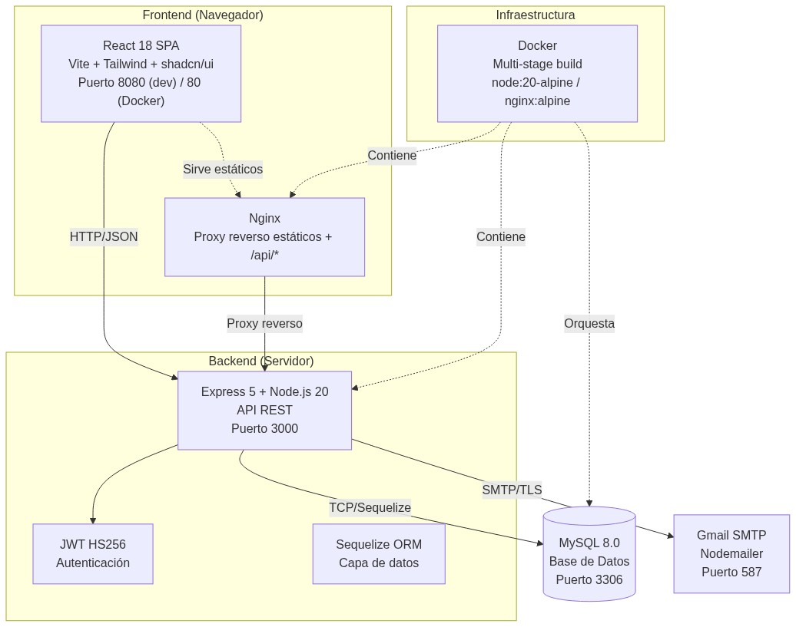

### Explicación del diagrama

A diferencia del Diagrama de Contexto (vista de negocio), este diagrama muestra los **componentes técnicos**, sus **puertos**, **protocolos** y la **infraestructura Docker**. El frontend React se comunica con Nginx, que sirve archivos estáticos y redirige `/api/` al backend Express. El backend usa Sequelize para conectar a MySQL, Nodemailer para enviar correos via Gmail SMTP, y JWT (HS256) para autenticación. Docker contenedoriza tanto frontend como backend.

---

## 3. Diagrama de Componentes (C4 Nivel 3)

### Componentes del Backend encontrados en el código fuente

#### Routes (Rutas)

| Ruta Base | Archivo | Módulo |
|-----------|---------|--------|
| `/api/auth` | `auth.routes.js` | Autenticación |
| `/api/fundaciones` | `fundacion.routes.js` | Fundaciones |
| `/api/mascotas` | `mascota.routes.js` | Mascotas |
| `/api/usuarios` | `user.routes.js` | Usuarios |
| `/api/roles` | `rol.routes.js` | Roles |
| `/api/solicitudes` | `solicitud.routes.js` | Solicitudes de adopción |
| `/api/seguimientos` | `seguimiento.routes.js` | Seguimientos post-adopción |
| `/api/notificaciones` | `notificacion.routes.js` | Notificaciones |
| `/api/reportes` | `reporte.routes.js` | Reportes y estadísticas |
| `/api/favoritos` | `favorito.routes.js` | Favoritos |
| `/api/perfil-adoptante` | `perfil_adoptante.routes.js` | Perfil adoptante |
| `/api/temperamentos` | `temperamento.routes.js` | Temperamentos de mascotas |

#### Controllers (Controladores)

| Controlador | Responsabilidad |
|-------------|----------------|
| `auth.controller.js` | Register, Login, VerifyEmail, ResendVerification, Refresh, Logout, ForgotPassword, ResetPassword |
| `fundacion.controller.js` | CRUD fundaciones, aprobar/rechazar, upload logo |
| `mascota.controller.js` | CRUD mascotas |
| `foto_mascota.controller.js` | Upload y delete de fotos de mascotas |
| `user.controller.js` | CRUD usuarios, perfil, cambio contraseña, upload foto |
| `perfil_adoptante.controller.js` | Get/Update perfil adoptante |
| `rol.controller.js` | CRUD roles |
| `solicitud.controller.js` | CRUD solicitudes, cambios de estado (evaluar, aprobar, rechazar, finalizar, cancelar) |
| `solicitud_detalle.controller.js` | Notas, tareas, citas, documentos, checklist, contrato |
| `seguimiento.controller.js` | CRUD seguimientos, completar |
| `notificacion.controller.js` | CRUD notificaciones, marcar leídas |
| `reporte.controller.js` | Reportes público, general, mascotas, solicitudes, fundaciones, usuarios, excel |
| `favorito.controller.js` | Toggle favorito, listar, check |
| `temperamento.controller.js` | Listar temperamentos |

#### Services (Servicios)

| Servicio | Responsabilidad |
|----------|----------------|
| `auth.service.js` | Lógica de registro, login, verificación email, refresh token, logout, forgot/reset password |
| `fundacion.service.js` | Lógica de CRUD y aprobación de fundaciones |
| `mascota.service.js` | Lógica de CRUD de mascotas con filtros y paginación |
| `foto_mascota.service.js` | Lógica de creación y eliminación de fotos |
| `user.service.js` | Lógica de CRUD de usuarios y cambio de contraseña |
| `perfil_adoptante.service.js` | Lógica de perfil adoptante (housing, experiencia, etc.) |
| `rol.service.js` | Lógica de roles |
| `solicitud.service.js` | Lógica de solicitudes con máquina de estados, historial, notificaciones |
| `solicitud_detalle.service.js` | Lógica de notas, tareas, citas, documentos, checklist y contrato digital |
| `seguimiento.service.js` | Lógica de seguimientos post-adopción |
| `notificacion.service.js` | Lógica de notificaciones por usuario |
| `reporte.service.js` | Lógica de reportes y generación de Excel |
| `favorito.service.js` | Lógica de favoritos |

#### Middlewares

| Middleware | Responsabilidad |
|------------|----------------|
| `auth.middleware.js` | Validación de JWT (HS256) |
| `role.middleware.js` | Validación de roles: ADMINISTRADOR (1), FUNDACION (2), ADOPTANTE (3) |
| `rateLimiter.middleware.js` | Rate limiting: login (5 intentos/15min), IP brute force (30 req/15min), creación (20/hora), solicitudes (10/hora), API general (500/15min) |
| `validate.middleware.js` | Validación de schemas Zod |

#### Models (Modelos Sequelize)

| Modelo | Tabla | Descripción |
|--------|-------|-------------|
| `Rol` | `rol` | Roles del sistema (ADMINISTRADOR, FUNDACION, ADOPTANTE) |
| `User` | `usuario` | Usuarios con autenticación y verificación |
| `Fundacion` | `fundacion` | Datos de fundaciones |
| `Mascota` | `mascota` | Mascotas disponibles para adopción |
| `FotoMascota` | `foto_mascota` | Fotos de mascotas |
| `Temperamento` | `temperamento` | Temperamentos (alegre, cariñoso, etc.) |
| `MascotaTemperamento` | `mascota_temperamento` | Relación N:M mascota-temperamento |
| `Solicitud` | `solicitud` | Solicitudes de adopción |
| `SolicitudHistorial` | `solicitud_historial` | Auditoría de cambios de estado |
| `SolicitudEvaluacion` | `solicitud_evaluacion` | Checklist de evaluación |
| `SolicitudCita` | `solicitud_cita` | Citas programadas |
| `SolicitudDocumento` | `solicitud_documento` | Documentos subidos |
| `SolicitudNota` | `solicitud_nota` | Notas internas/compartidas |
| `SolicitudTarea` | `solicitud_tarea` | Tareas pendientes |
| `Seguimiento` | `seguimiento` | Seguimiento post-adopción |
| `Notificacion` | `notificacion` | Notificaciones del sistema |
| `Favorito` | `favorito` | Favoritos de adoptantes |
| `PerfilAdoptante` | `perfil_adoptante` | Perfil detallado del adoptante |

#### Database Layer

| Archivo | Responsabilidad |
|---------|----------------|
| `config/db.js` | Configuración de Sequelize con MySQL |
| `config/associations.js` | Definición de relaciones entre modelos |

#### Utils

| Utilidad | Responsabilidad |
|----------|----------------|
| `utils/jwt.js` | Generación de tokens JWT (HS256) |
| `utils/email.js` | Transporter Nodemailer + funciones de envío |
| `utils/multer.js` | Configuración de subida de archivos |
| `utils/imageResizer.js` | Redimensionamiento de imágenes con Sharp |
| `utils/pagination.js` | Paginación genérica |
| `utils/logger.js` | Logger Winston con archivos rotativos |
| `utils/pathResolver.js` | Resolución de rutas de uploads |

#### Validators

| Validador | Schemas Zod |
|-----------|-------------|
| `auth.validator.js` | register, login, resendVerification, refresh, logout |
| `user.validator.js` | update, updatePassword |
| `mascota.validator.js` | create, update |
| `fundacion.validator.js` | create, update, aprobar |
| `solicitud.validator.js` | create, estadoChange |

### Diagrama Mermaid

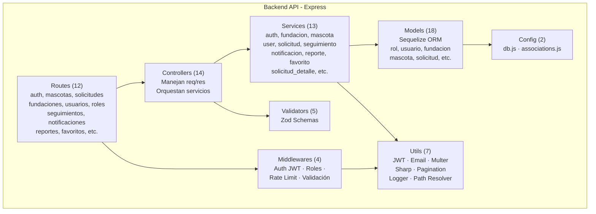

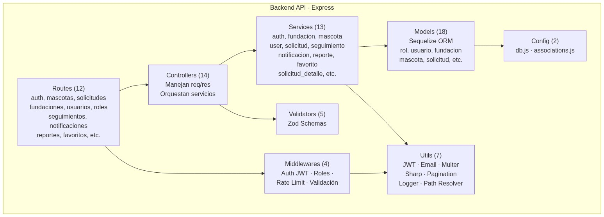

### Explicación del diagrama

El backend sigue una arquitectura en capas modular por dominio. Las **Routes** definen los endpoints y aplican middlewares. Los **Controllers** reciben el request, validan con **Zod** y delegan en **Services**. Los Services contienen toda la lógica de negocio y usan los **Models** (Sequelize) para persistencia. Los **Utils** proveen funcionalidades transversales (JWT, email, upload, imágenes). Las **associations** se definen centralizadamente en `config/associations.js`. Cada módulo (`auth`, `users`, `mascotas`, `solicitudes`, etc.) agrupa sus propios archivos.

---

## 4. Diagrama de Integraciones

### Clasificación

Se distinguen dos categorías:

1. **Integraciones Externas** — Servicios fuera del proyecto que el sistema consume.
2. **Librerías Internas** — Paquetes npm que se ejecutan dentro del proceso del backend.

### Integraciones Externas (reales)

| Integración | Propósito | Tecnología | Componente | Puerto |
|-------------|-----------|------------|------------|--------|
| **MySQL** | Base de datos principal | MySQL 8.0 + Sequelize ORM + mysql2 | `config/db.js` | 3306 |
| **Gmail SMTP** | Correos transaccionales (verificación, notificaciones, recuperación) | Nodemailer | `utils/email.js` | 587 |

### Librerías Internas (NO son integraciones externas)

| Librería | Propósito | Tipo |
|----------|-----------|------|
| **JWT + bcryptjs** | Autenticación y autorización | Librería de seguridad |
| **Multer + Sharp** | Upload y redimensionamiento de imágenes | Librería de middleware |
| **Zod** | Validación de schemas de datos | Librería de validación |
| **Winston + Morgan** | Logging estructurado y peticiones HTTP | Librería de logging |
| **Helmet + CORS** | Seguridad HTTP y Cross-Origin | Librería de seguridad |
| **express-rate-limit** | Rate limiting y brute force protection | Librería de seguridad |
| **ExcelJS** | Generación de reportes en Excel | Librería de utilidad |
| **PDFKit** | Generación de contratos de adopción en PDF | Librería de utilidad |
| **PM2** | Gestión de procesos Node.js en producción | Gestor de procesos |

### Integraciones NO encontradas

Las siguientes plataformas **no existen** en el código fuente:

- **Cloudinary**: No encontrado
- **Supabase**: No encontrado
- **Firebase**: No encontrado
- **Vercel**: No encontrado (no hay vercel.json ni configuración)
- **Railway**: No encontrado
- **Render**: No encontrado
- **Fly.io**: No encontrado

### Diagrama Mermaid

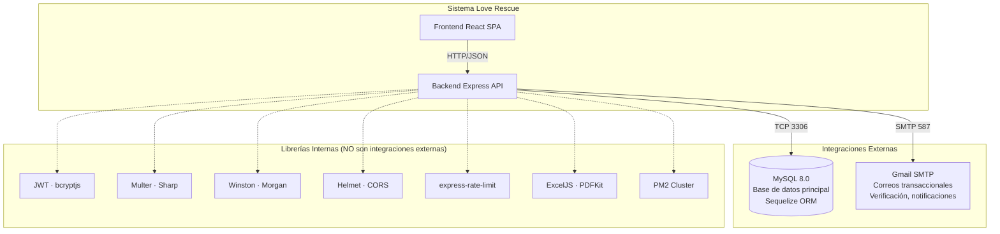

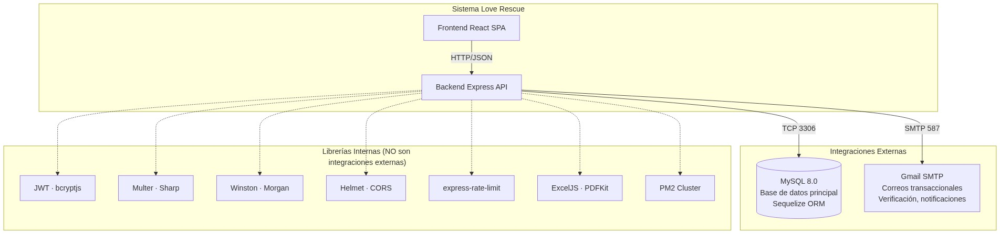

### Explicación del diagrama

El diagrama separa claramente **integraciones externas** (MySQL y Gmail SMTP) de **librerías internas** (JWT, Multer, Sharp, Zod, Winston, Helmet, etc.). Las integraciones externas son servicios que corren fuera del proyecto y se comunican por red (TCP 3306, SMTP 587). Las librerías internas se ejecutan dentro del proceso Node.js y no son servicios externos. Esta distinción es importante para entender el alcance real del despliegue.

---

## 5. Diagrama DevOps

### 5.1 DevOps Actual (lo que existe en el repositorio)

| Componente | Estado en el código |
|-----------|---------------------|
| **Git** | ✓ Repositorio git inicializado |
| **GitHub** | ✓ Carpeta `.git` presente. No se encontró URL remota configurada. Se asume GitHub. |
| **Branch** | ✓ `main` |
| **.gitignore** | ✓ node_modules, dist, .env, logs, Thumbs.db, .DS_Store |
| **Docker Backend** | ✓ `Dockerfile` multi-stage con node:20-alpine, EXPOSE 3000 |
| **Docker Frontend** | ✓ `Dockerfile` multi-stage con nginx:alpine, EXPOSE 80 |
| **nginx.conf** | ✓ Proxy reverso configurado para `/api/` y `/uploads/` |
| **PM2** | ✓ `ecosystem.config.js` con cluster mode |
| **docker-compose.yml** | ❌ **No existe** |
| **CI/CD Pipeline** | ❌ **No existe** (no hay `.github/workflows/`) |
| **Vercel config** | ❌ **No existe** (no hay `vercel.json`) |
| **Railway config** | ❌ **No existe** |
| **Render config** | ❌ **No existe** |

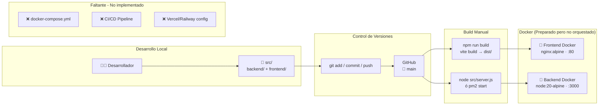

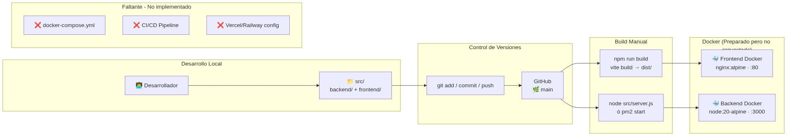

**Explicación**: El flujo actual es totalmente manual. El desarrollador escribe código, lo sube a GitHub, luego construye manualmente el frontend (`vite build`) y ejecuta el backend (`node src/server.js` o `pm2 start`). Los Dockerfiles están preparados pero no hay `docker-compose.yml` ni CI/CD. El despliegue a producción requiere pasos manuales.

---

### 5.2 DevOps Recomendado (propuesta de despliegue automatizado)

> **Nota**: Esto es una **recomendación futura**. Ninguno de estos servicios está configurado actualmente en el código.

| Plataforma | Servicio | Justificación |
|-----------|----------|---------------|
| **GitHub** | Repositorio (existente) + GitHub Actions (propuesta) | El repositorio git ya existe; GitHub Actions es una propuesta futura |
| **Vercel** | Frontend (SPA React) | Gratuito, build automático desde GitHub, soporte Vite nativo |
| **Railway** | Backend (Express + MySQL) | MySQL nativo gratuito, despliegue simple, 500h/mes gratis |
| **Aiven** | MySQL alternativa | 5GB gratis si no se usa Railway |

#### Flujo recomendado

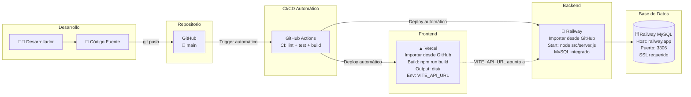

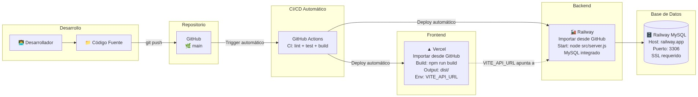

**Explicación**: Con GitHub Actions como CI/CD, al hacer `git push` a `main` se dispara automáticamente el build y deploy: el frontend se despliega en Vercel y el backend en Railway con MySQL integrado. Esto elimina los pasos manuales del flujo actual.

---

## 6. Arquitectura Tecnológica

### Frontend

| Tecnología | Versión | Uso |
|-----------|---------|-----|
| React | ^18.3.1 | Biblioteca de interfaz de usuario |
| TypeScript | ^5.8.3 | Tipado estático |
| Vite | ^5.4.19 | Bundler y dev server |
| Tailwind CSS | ^3.4.17 | Framework de estilos utilitario |
| shadcn/ui (Radix UI) | — | Componentes de UI accesibles |
| React Router DOM | ^6.30.1 | Enrutamiento SPA |
| TanStack React Query | ^5.83.0 | Estado asíncrono y cacheo de API |
| React Hook Form | ^7.61.1 | Manejo de formularios |
| Zod | ^3.25.76 | Validación de schemas |

### Backend

| Tecnología | Versión | Uso |
|-----------|---------|-----|
| Node.js | 20 (Alpine) | Runtime de JavaScript |
| Express | ^5.2.1 | Framework HTTP para API REST |
| Sequelize | ^6.37.8 | ORM para base de datos relacional |
| mysql2 | ^3.22.3 | Driver de MySQL para Node.js |
| bcryptjs | ^3.0.3 | Hashing de contraseñas |
| jsonwebtoken | ^9.0.3 | Tokens JWT (HS256) |
| Zod | ^4.4.3 | Validación de datos de entrada |

### Base de Datos

| Tecnología | Versión | Uso |
|-----------|---------|-----|
| MySQL | 8.0 | Motor de base de datos relacional |
| Sequelize | ^6.37.8 | ORM para mapeo objeto-relacional |
| mysql2 | ^3.22.3 | Conector nativo MySQL |

### Seguridad

| Tecnología | Uso |
|-----------|-----|
| JWT (jsonwebtoken) | Autenticación stateless con tokens HS256 |
| bcryptjs | Hashing de contraseñas (salt rounds = 10) |
| Helmet | Headers de seguridad HTTP (CSP, HSTS, XSS, etc.) |
| CORS | Control de orígenes cruzados (whitelist) |
| express-rate-limit | Rate limiting por IP y por email |
| Zod | Validación de esquemas en endpoints críticos |

### Infraestructura

| Tecnología | Uso |
|-----------|-----|
| Docker (multi-stage) | Contenerización de frontend y backend |
| Nginx (alpine) | Servidor web y proxy reverso |
| PM2 | Gestión de procesos Node.js en cluster mode |
| Git | Control de versiones |

### Almacenamiento de archivos

| Tipo | Ubicación | Gestión |
|------|-----------|---------|
| Imágenes de mascotas | `uploads/mascotas/fotos/` | Multer + Sharp (resize 800x800) |
| Logos de fundaciones | `uploads/fundaciones/logos/` | Multer + Sharp (resize 300x300) |
| Fotos de perfil | `uploads/usuarios/perfiles/` | Multer + Sharp (resize 400x400) |
| Documentos de solicitudes | `uploads/solicitudes/documentos/` | Multer (PDF, JPG, PNG, DOC) |
| Contratos PDF | `uploads/contratos/` | PDFKit (generación dinámica) |

---

## 7. Inventario Técnico

### Tecnologías utilizadas

| Capa | Tecnología | Versión |
|------|-----------|---------|
| **Frontend** | React | ^18.3.1 |
| **Frontend** | TypeScript | ^5.8.3 |
| **Frontend** | Vite | ^5.4.19 |
| **Frontend** | Tailwind CSS | ^3.4.17 |
| **Frontend** | shadcn/ui (Radix UI) | Varios |
| **Backend** | Node.js | 20 (Alpine) |
| **Backend** | Express | ^5.2.1 |
| **Backend** | Sequelize ORM | ^6.37.8 |
| **Backend** | MySQL | 8.0 |
| **Backend** | JWT (jsonwebtoken) | ^9.0.3 |
| **Backend** | bcryptjs | ^3.0.3 |
| **Backend** | Zod | ^4.4.3 |
| **DevOps** | Docker | Multi-stage |
| **DevOps** | PM2 | ecosystem.config.js |
| **DevOps** | nginx | alpine |

### Librerías Frontend

| Librería | Propósito |
|----------|-----------|
| `@tanstack/react-query` | Gestión de estado asíncrono y cacheo de API |
| `react-router-dom` ^6.30.1 | Enrutamiento SPA |
| `react-hook-form` + `@hookform/resolvers` | Formularios con validación |
| `zod` | Validación de schemas |
| `lucide-react` | Iconos SVG |
| `recharts` | Gráficos en reportes |
| `date-fns` | Manipulación de fechas |
| `sonner` + `vaul` | Notificaciones toast y drawers |
| `next-themes` | Modo oscuro/claro |
| `class-variance-authority` + `clsx` + `tailwind-merge` | Utilidades CSS |
| `embla-carousel-react` | Carrusel de imágenes |
| `cmdk` | Command palette |
| `input-otp` | Input OTP |

### Librerías Backend

| Librería | Propósito |
|----------|-----------|
| `express` ^5.2.1 | Framework web |
| `sequelize` ^6.37.8 + `mysql2` ^3.22.3 | ORM y driver MySQL |
| `jsonwebtoken` ^9.0.3 + `bcryptjs` ^3.0.3 | Autenticación |
| `cors` ^2.8.6 + `helmet` ^8.1.0 | Seguridad HTTP |
| `morgan` ^1.10.1 + `winston` ^3.19.0 | Logging |
| `express-rate-limit` ^8.5.2 | Rate limiting |
| `multer` ^2.1.1 + `sharp` ^0.34.5 | Upload y procesamiento de imágenes |
| `nodemailer` ^8.0.7 | Envío de correos |
| `zod` ^4.4.3 | Validación de datos |
| `exceljs` ^4.4.0 | Generación de reportes Excel |
| `pdfkit` ^0.18.0 | Generación de contratos PDF |
| `dotenv` ^17.4.2 | Variables de entorno |

### Base de datos

| Elemento | Detalle |
|----------|---------|
| **Motor** | MySQL 8.0 |
| **Base de datos** | `adopcion_mascotas` |
| **Tablas** | 18 (rol, usuario, fundacion, mascota, foto_mascota, temperamento, mascota_temperamento, solicitud, solicitud_historial, solicitud_evaluacion, solicitud_cita, solicitud_documento, solicitud_nota, solicitud_tarea, seguimiento, notificacion, favorito, perfil_adoptante) |
| **ORM** | Sequelize 6.37.8 |
| **Migraciones** | No hay sistema de migraciones; se usa `sync()` en server.js y scripts SQL manuales en `/scripts/` |

### Herramientas DevOps

| Herramienta | Propósito |
|-------------|-----------|
| **Docker** | Contenerización multi-stage |
| **nginx** | Servidor web + proxy reverso |
| **PM2** | Cluster mode, logs, restart management |
| **Git** | Control de versiones |

### Dependencias críticas

| Dependencia | Riesgo | Mitigación |
|-------------|--------|------------|
| Express 5 (RC) | Versión no estable | Monitorear cambios API |
| Sequelize 6 con sync() | Puede alterar esquema en producción | Deshabilitar sync en producción |
| Zod ^4.4.3 | Breaking changes respecto a v3 | Revisar migración |
| Sharp (nativo) | Requiere build tools en Docker | Alpine incluye dependencias |
| Contraseña SMTP hardcodeada en .env | Exposición de credenciales | Usar variables de entorno seguras |

---

## 8. Matriz de Trazabilidad

Cada afirmación en este documento está respaldada por archivos específicos del código fuente del proyecto.

| Documento | Sección | Archivo fuente | Línea(s) | Evidencia |
|-----------|---------|---------------|----------|-----------|
| Arquitectura | §1 Contexto - Roles | `database/seed.sql` | 92-95 | `INSERT INTO rol VALUES (1,'ADMINISTRADOR'),(3,'ADOPTANTE'),(2,'FUNDACION')` |
| Arquitectura | §1 Contexto - Sistema | `fronted/package.json` + `backend/package.json` | (todo) | `"react": "^18.3.1"`, `"express": "^5.2.1"` |
| Arquitectura | §2 Arquitectura - Puerto 8080 | `fronted/vite.config.ts` | 10 | `port: 8080` |
| Arquitectura | §2 Arquitectura - Puerto 3000 | `backend/.env` | 1 | `PORT=3000` |
| Arquitectura | §2 Arquitectura - Puerto 3306 | `backend/.env` | 4 | `DB_PORT=3306` |
| Arquitectura | §2 Arquitectura - Puerto 587 | `backend/.env` | 13 | `SMTP_PORT=587` |
| Arquitectura | §2 Arquitectura - Nginx proxy | `fronted/nginx.conf` | 9-16 | `location /api/ { proxy_pass http://backend:3000/api/; }` |
| Arquitectura | §2 Arquitectura - Docker backend | `backend/Dockerfile` | 1-29 | `FROM node:20-alpine`, `EXPOSE 3000` |
| Arquitectura | §2 Arquitectura - Docker frontend | `fronted/Dockerfile` | 1-22 | `FROM nginx:alpine`, `EXPOSE 80` |
| Arquitectura | §2 Arquitectura - JWT HS256 | `backend/src/utils/jwt.js` | 17 | `algorithm: 'HS256'` |
| Arquitectura | §2 Arquitectura - bcrypt salt 10 | `backend/src/modules/auth/services/auth.service.js` | 28 | `bcrypt.hash(password, 10)` |
| Arquitectura | §3 Componentes - Routes | `backend/src/app.js` | 133-158 | `app.use('/api/auth', authRoutes)`, etc. (12 rutas) |
| Arquitectura | §3 Componentes - Middleware auth | `backend/src/middlewares/auth.middleware.js` | 20-23 | `jwt.verify(token, JWT_SECRET, { algorithms: ['HS256'] })` |
| Arquitectura | §3 Componentes - Middleware roles | `backend/src/middlewares/role.middleware.js` | 1-5 | `ROLE_MAP = { 1: 'ADMINISTRADOR', 2: 'FUNDACION', 3: 'ADOPTANTE' }` |
| Arquitectura | §3 Componentes - 18 modelos | `backend/src/config/associations.js` | 1-141 | 18 require() de modelos y sus relaciones |
| Arquitectura | §3 Componentes - Validators | `backend/src/middlewares/validate.middleware.js` | 1-12 | `schema.safeParse(req[source])` con Zod |
| Arquitectura | §3 Componentes - Rate limiting | `backend/src/middlewares/rateLimiter.middleware.js` | 54-145 | login, IP brute force, auth, create, solicitud y api limiters (5 mecanismos) |
| Arquitectura | §4 Integraciones - MySQL | `backend/src/config/db.js` | 4-14 | `new Sequelize(... { dialect: 'mysql' })` |
| Arquitectura | §4 Integraciones - Gmail SMTP | `backend/src/utils/email.js` | 12-23 | `nodemailer.createTransport({ host: SMTP_HOST, port: SMTP_PORT })` |
| Arquitectura | §4 Integraciones - Multer | `backend/src/utils/multer.js` | 1-61 | Configuración completa de multer diskStorage |
| Arquitectura | §4 Integraciones - Sharp | `backend/src/utils/imageResizer.js` | 1-29 | `sharp(filePath).resize(...)` |
| Arquitectura | §4 Integraciones - Winston | `backend/src/utils/logger.js` | 1-42 | `winston.createLogger({...})` con File + Console |
| Arquitectura | §4 Integraciones - Helmet/CORS | `backend/src/app.js` | 37-94 | `cors()`, `helmet()` con CSP, HSTS |
| Arquitectura | §4 Integraciones - ExcelJS | `backend/src/modules/reportes/services/reporte.service.js` | (ses previa) | `ExcelJS.Workbook` para reportes |
| Arquitectura | §4 Integraciones - PDFKit | `backend/src/modules/solicitudes/services/solicitud_detalle.service.js` | (ses previa) | Generación de contrato PDF |
| Arquitectura | §4 Integraciones - PM2 | `backend/ecosystem.config.js` | 1-26 | `exec_mode: 'cluster'`, `instances: 'max'` |
| Arquitectura | §5 DevOps - Dockerfiles | `backend/Dockerfile`, `fronted/Dockerfile` | (completos) | Multi-stage builds |
| Arquitectura | §5 DevOps - docker-compose | `glob '**/docker-compose*'` | 0 resultados | No existe |
| Arquitectura | §5 DevOps - CI/CD | `glob '.github/**'` | 0 resultados | No existe |
| Arquitectura | §6 Arq. Tecnológica | `fronted/package.json` + `backend/package.json` | (completos) | Todas las dependencias |
| Arquitectura | §6 Arq. Tecnológica - Upload paths | `backend/src/utils/pathResolver.js` | 6-11 | `SUBDIRS` con todas las rutas de upload |
| Manual Despliegue | §1 Requisitos | `backend/Dockerfile`, `fronted/Dockerfile` | 1, 1 | `FROM node:20-alpine` |
| Manual Despliegue | §2 Instalación - DB | `database/schema.sql` | 1-5 | `Server version 8.0.46`, `Database: adopcion_mascotas` |
| Manual Despliegue | §2 Instalación - .env | `backend/.env.example` | 1-31 | Variables de entorno completas |
| Manual Despliegue | §2 Instalación - .env front | `fronted/.env.example` | 1 | `VITE_API_URL=http://localhost:3000/api` |
| Manual Despliegue | §5 Problemas - CORS | `backend/src/app.js` | 37-54 | `allowedOrigins = ['http://localhost:8080', ...]` |
| Manual Despliegue | §5 Problemas - JWT | `backend/src/middlewares/auth.middleware.js` | 20-23 | HS256 algorithm |
| Manual Despliegue | §3 Nginx config | `fronted/nginx.conf` | 1-23 | Configuración completa de proxy |

---

> **Nota**: Este documento fue generado a partir del análisis exhaustivo del código fuente del proyecto Love Rescue E196 Blanco.  
> Los diagramas PNG en `docs/diagramas/` se generaron a partir del código Mermaid incluido en este documento.  
> Cualquier tecnología, integración o servicio no listado aquí no fue encontrado en el código.  
> Las secciones marcadas como "Recomendado" son propuestas futuras, no implementaciones actuales.
